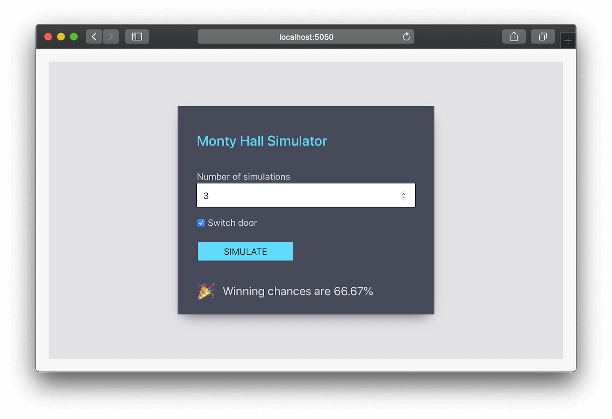

# Monty Hall Simulator

## A simple web application to simulate Monty Hall problem.

### Setup instructions
- Clone this repository
  ```
  git clone git@github.com:rakibtg/MontyHall.git
  ```
- Run `npm install` in both **frontend** and **backend** repositories.
- Now, go to **backend** and run 
    - `npm run dev` for dev mode with live reload, 
    - or `npm run start` for production mode
- Then go to **frontend** and run
    - `npm run start`
- Finally, go to http://localhost:5050 to use the application

### Testing Frontend
- Go to **frontend** and run
    - `npm run test`
    - Press `a` to run all tests. *(optional)*

### Testing Backend
- Go to **backend** and run
    - `npm run test`

### Few Tips
- To observe the disabled state and loading state use `50000000` number of simulations, as it will take some time to process.
- Use `3` as number of simulations to see the floating value of the score (Try more than one time).
- Use `1` as number of simulations to see different emojis based on score 🧐

